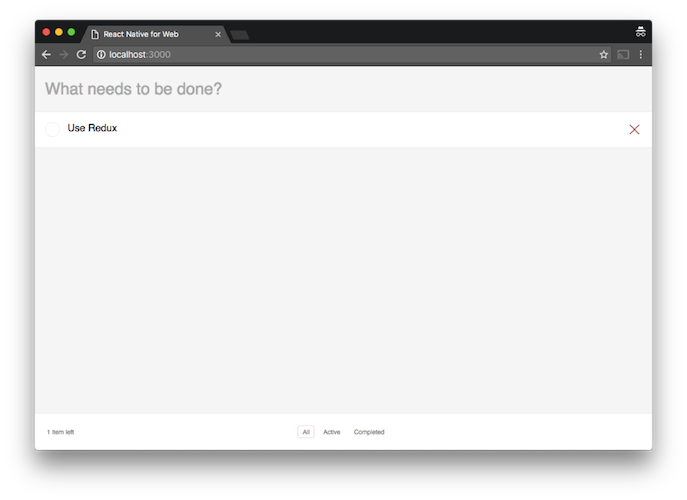

# ReactNativeTodoMVC

This is a demo to introduce how to use ReactNative as a solution to progressively enhance your existing web app experience. Explore feature branches to see the application in action.

## Screenshots

### Use ReactNative as Corvado 

<https://github.com/toruta39/ReactNativeTodoMVC/tree/feature/webview-bridge>

  

### Port ReactDOM to ReactNative

<https://github.com/toruta39/ReactNativeTodoMVC/tree/feature/port-to-native>

### Use ReactNative for Web

<https://github.com/toruta39/ReactNativeTodoMVC/tree/feature/use-react-native-web> 

## Presentation (Chinese Version)

https://speakerdeck.com/toruta39/from-react-to-reactnative-progressively-enhancing-your-app-experience-chinese-version
